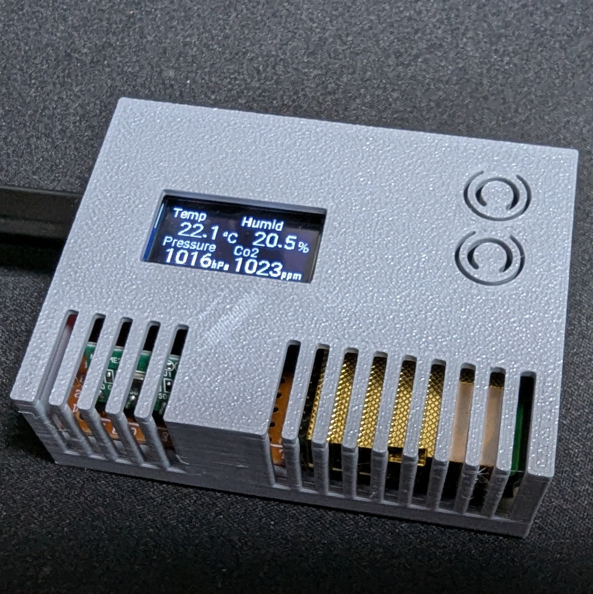
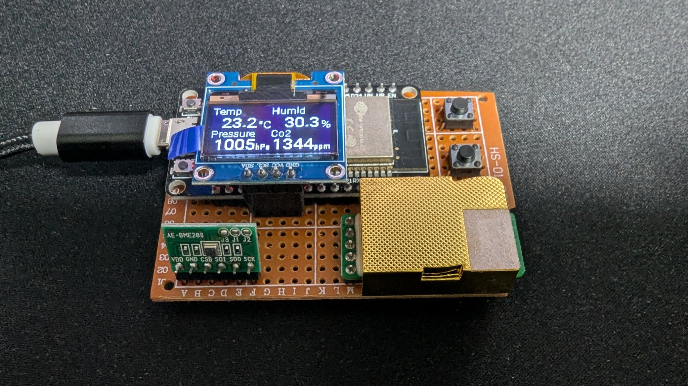

# Co2 Sensor

> Case made by 3D printer: [Top.stl](Top.stl), [Bottom.stl](Bottom.stl)

## Parts

|Genre|Parts||
|:--|:--|:--|
|Micro controller|ESP-WROOM-32 dev board||
|Display|SSD1603 128x64 0.96inch|[Aliexpress](https://ja.aliexpress.com/item/1005007614149117.html)|
|Temperature sensor|BME280|[Akizuki](https://akizukidenshi.com/catalog/g/g109421/)|
|Co2 Sensor|MH-Z19C|[Akizuki](https://akizukidenshi.com/catalog/g/g116142/)|
|Button|Tact switch|(Implemented but not used)|
|Universal board|(70x50mm)||
|Wire|||

## Wire

- MH-Z19C -> ESP32 Uart(TX: GPIO17, RX: GPIO16)
- BME280, Display -> ESP32 I2C(SDA: GPIO21, SDL: GPIO22)
- Buttons -> ESP32 GPIO18, GPIO19

## Software setup
1. Setup the [ESPHome](https://esphome.io/)
2. Connect ESP32 to ESPHome
3. Build & Install co2 sensor code using [co2-sensor.yaml](co2-sensor.yaml) (HASS API and OTA have been deleted. Please remember to add them if needed.)
